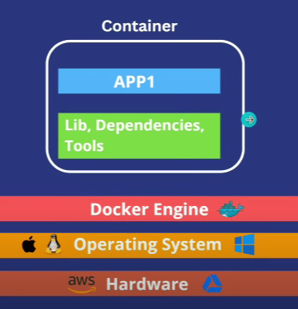

# 🐳DOCKER

## 0. Environment Consistency Problem
Different environments (development, testing, production) may have different configurations, dependencies, and versions, leading to the classic "it works on my machine" problem.
Docker ensures that the application runs in a consistent environment across all stages. By packaging the application and its dependencies into a container, Docker guarantees that it will behave the same way regardless of where it is deployed.

<br>

## 1. What is Docker?

Docker is an open-source platform designed to automate the deployment, scaling, and management of applications. It allows developers to package applications and their dependencies into a standardized unit called a container. This ensures that the application runs consistently across different environments, from development to production.

### Key Concepts

1. **Containers**:
    - Containers are lightweight, portable, and self-sufficient units that include everything needed to run a piece of software, such as code, runtime, libraries, and system tools.
    - They share the host system's kernel but operate in isolation, providing a consistent runtime environment.

2. **Images**:
    - Docker images are read-only templates used to create containers. They include the application code, libraries, and dependencies required to run the application.
    - Images can be built from a set of instructions written in a `Dockerfile`.

3. **Dockerfile**:
    - A `Dockerfile` is a text document containing a series of instructions on how to build a Docker image.
    - Each instruction in a `Dockerfile` creates a layer in the image, contributing to the final build.

4. **Docker Engine**:
    - Docker Engine is the underlying client-server technology that builds and runs containers.
    - It consists of a server (`dockerd`), a REST API, and a client (`docker`).

5. **Docker Hub**:
    - Docker Hub is a cloud-based registry service where Docker users and partners can create, test, store, and distribute container images.
    - It provides a central repository to find and share container images.

<br>

## 2. Docker Architecture

<div style="display: flex" align="center">

  <br>Single Container </br>

 <br>Multiple containers for multiple apps</br>

</div>
<br>

## 3. Running multiple versions of same application

<div style="display: flex" align="center">


</div>
<br>

## 4. Docker vs Virtual Machines (VMs)

| Feature             | Docker Containers                 | Virtual Machines (VMs)         |
|---------------------|-----------------------------------|--------------------------------|
| **Architecture**    | Shares host OS kernel             | Full OS including guest OS     |
| **Performance**     | Near-native performance           | Higher overhead                |
| **Resource Usage**  | Lightweight, efficient            | Resource-intensive             |
| **Startup Time**    | Fast (seconds)                    | Slower (minutes)               |
| **Portability**     | Highly portable                   | Less portable                  |
| **Isolation**       | Process-level isolation           | Hardware-level isolation       |
| **Use Cases**       | Microservices, CI/CD, Dev/Test    | Full OS, legacy apps, isolation|

---

<br>

## 5. Main Components of Docker

- **Docker File** : A Dockerfile is a script containing a series of instructions on how to build a Docker image. Each instruction in the Dockerfile adds a layer to the image, and when executed, it constructs a complete image that can be used to create containers. These containers are instances of the image, running isolated and portable environments for your applications.
- **Docker Image** : A Docker image is a lightweight, standalone, and executable software package that includes everything needed to run a piece of software, including the code, runtime, libraries, environment variables, and configuration files. Docker images are used to create containers, which are instances of these images running as isolated processes on a host operating system.
- **Docker Container** : A Docker container is a lightweight, standalone, executable package of software that includes everything needed to run an application: code, runtime, system tools, libraries, and settings. Containers are created from Docker images and can run on any system that has the Docker platform installed, ensuring consistency across different environments.
- **Docker Registry** : A Docker registry is a centralized repository where Docker images are stored, managed, and distributed. It allows users to share and deploy images easily across different environments. Registries can be public or private, with **Docker Hub** being the most well-known public registry.

<br>

## 6. Flow of Docker 


<br>

## 7. Creating Dockerfile, Image and Container

This Dockerfile is used to create a Docker image with Node.js installed, suitable for running a Node.js application.

### Dockerfile Content

```Dockerfile
# Base image: Here we are using the official Node.js image. 
# We can specify a specific version of the Node.js image, in this case, version 20.
FROM node:20

# Working directory: Setting the working directory to /myapp (this will create the directory in the container if it doesn't exist).
WORKDIR /myapp

# Copying all files from the current directory on the host to the /myapp directory in the container.
COPY . .

# Installing all dependencies specified in package.json.
RUN npm install

# Exposing the port 3000. This informs Docker that the container listens on this network port at runtime.
EXPOSE 3000

# Running the application using npm start, which should be defined in the package.json file's scripts section.
CMD ["npm", "start"]
```

### Building the Docker Image

To build the Docker image using the Dockerfile, run the following command in the terminal:

```sh
docker build -t your-image-name .
```

or 

```sh
docker build .
```

* `-t your-image-name` tags the image with a name. Replace `your-image-name` with a suitable name for your image.
* `.` refers to the current directory, where the Dockerfile is located.

### Verifying the Docker Image

After building the image, you can verify its creation by running:

```sh
docker images ls
```

This command lists all Docker images available on your system.

### Running the Docker Image

To run the Docker image, you have two options:
1. **Without port binding**: Run the container without exposing it to a specific port on the host machine.

    ```sh
    docker run your-image-name
    ```

2. **With port binding**: Bind the port 3000 of the container to the port 3000 of the host machine. This allows you to access the application on your host machine's port 3000.

    ```sh
    docker run -p 3000:3000 your-image-name
    ```

3. **With port binding in Detached Mode :** Running a Docker container in detached mode allows the container to run in the background, independent of the terminal session. This is useful for long-running applications or services, as it frees up the terminal for other tasks. To run a Docker container in detached mode, use the `-d` flag with the `docker run` command:

    ```sh
    docker run -d -p 3000:3000 your-image-name
    ```


### Checking Running Containers

To check if the Docker container is running, use the following command:

```sh
docker ps
```

This command lists all running Docker containers.

### Stopping the Docker Container

To stop the running Docker container, use the following command:

```sh
docker stop <container-id>
```

Replace `<container-id>` with the ID or name of the container you wish to stop. You can find the container ID or name from the `docker ps` output.

<br>

## 8. Running Multiple Containers of the Same Image

You can run multiple instances of the same Docker image, each listening on a different port on the host machine. This allows you to scale your application or test different configurations simultaneously. Here’s how to do it:

### Commands to Run Multiple Containers

```sh
docker run -d -p 3000:3000 5feb38d50bc3
docker run -d -p 3001:3000 5feb38d50bc3
docker run -d -p 3002:3000 5feb38d50bc3
```

### Explanation

1. **First Container**: 
    ```sh
    docker run -d -p 3000:3000 5feb38d50bc3
    ```
    This command runs the container in detached mode (`-d`) and maps port 3000 on the host to port 3000 in the container. The container is created from the image with ID `5feb38d50bc3`.

2. **Second Container**:
    ```sh
    docker run -d -p 3001:3000 5feb38d50bc3
    ```
    This command also runs the container in detached mode but maps port 3001 on the host to port 3000 in the container. Even though the container is using port 3000 internally, it’s accessible on port 3001 on the host machine.

3. **Third Container**:
    ```sh
    docker run -d -p 3002:3000 5feb38d50bc3
    ```
    Similar to the previous commands, this one runs the container in detached mode and maps port 3002 on the host to port 3000 in the container.

### Benefits

1. **Testing and Development**: Running multiple containers from the same image on different ports allows you to test different scenarios or configurations without interference.
2. **Load Balancing and Scaling**: This setup is useful for load balancing and scaling applications. You can distribute traffic across multiple containers to handle higher loads.
3. **Isolation**: Each container runs in isolation, so changes in one container won’t affect the others. This is useful for ensuring consistent behavior across different environments.

### Verifying Running Containers

To verify that all containers are running, use the following command:

```sh
docker ps
```

This will list all running Docker containers, including their port mappings.

### Stopping the Containers

To stop the running containers, use the `docker stop` command followed by the container IDs or names. For example:

```sh
docker stop <container-id-1> <container-id-2> <container-id-3>
```

Replace `<container-id-1>`, `<container-id-2>`, and `<container-id-3>` with the actual container IDs from the `docker ps` output.

---

